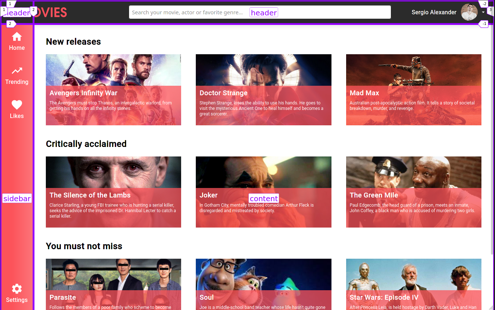

# Movies Page

Frontend exercise creating a movies page using css grid layout.

- Solution: http://movies-css-grid.xergioalex.com/

## Challenge

Create a movie page based on the following mockup:

## Solution

This is my solution inspired on the below mockup: http://movies-css-grid.xergioalex.com/

Css grid layout areas:

## :electric_plug: Powered by [XergioAleX](https://www.xergioalex.com/)

## License

This project is [MIT licensed](./LICENSE).
