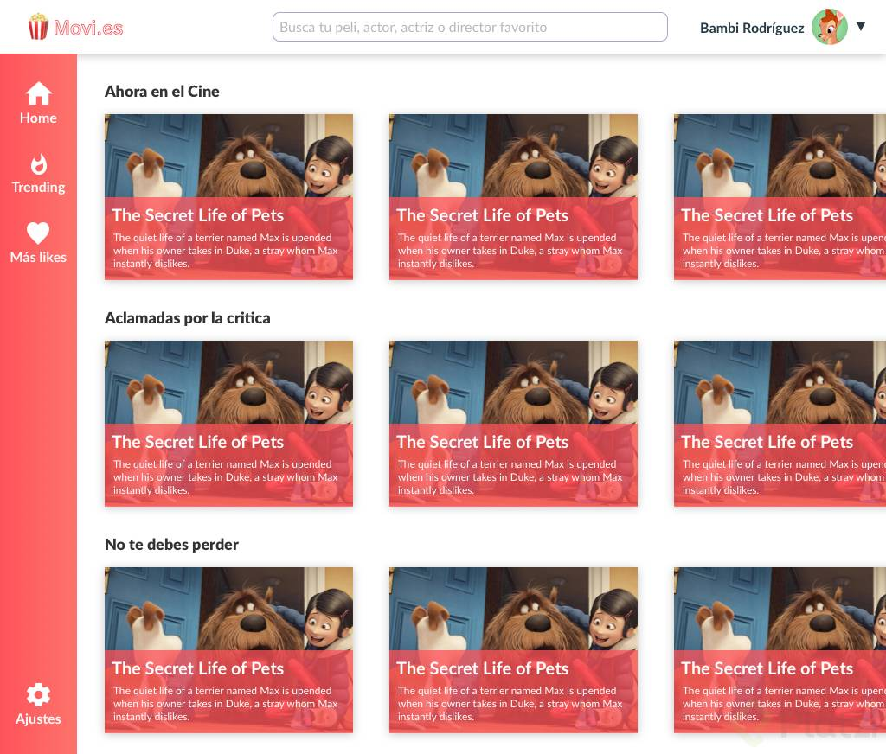

# Movies Page
Frontend exercise creating a movies page using css grid layout.

## Challenge

Create a movie page based on the following mockup:

## Solution

This is my solution inspired on the below mockup:

## :electric_plug: Powered by [XergioAleX](https://www.xergioalex.com/)

## License

This project is [MIT licensed](./LICENSE).
